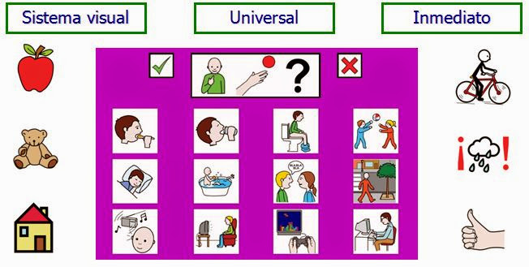
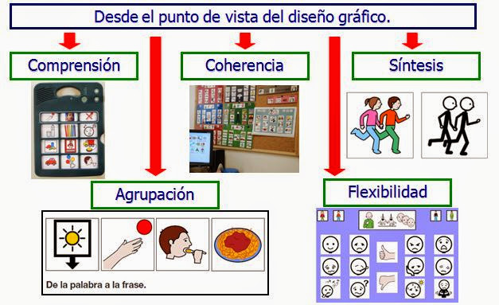

# 4.2 Características

#### CARACTER&Iacute;STICAS DE LOS SISTEMAS DE COMUNICACIÓN PCITOGR&Aacute;FICOS

Los **sistemas de comunicación aumentativa y alternativa**, basados en **pictogramas**,se caracterizan por ser universales, visuales e inmediatos.

Son **universales** en tanto que pictogramas como el de "manzana", "oso de peluche" o "casa" pueden ser entendidos por la mayor parte de las personas, independientemente de su idioma o cultura.

Son sistemas **visuales**, puesto que requieren de una adecuada percepción y discriminación visual. En el caso de que el usuario tenga dificultades en este ámbito, pueden realizarse adaptaciones utilizando pictogramas de mayor tamaño, más esquemáticos y/o en alto contraste.

Finalmente, son **inmediatos**, puesto que la comunicación se establece entre el emisor y el receptor tan solo señalando sobre el pictograma adecuado.

#### CARACTER&Iacute;STICAS A NIVEL DE DISEÑO GRÁFICO

Desde el punto de vista del **diseño gráfico y la accesibilidad**, ARASAAC es un Sistema de símbolos pictográficos para la comunicación aumentativa que se caracteriza por la comprensión, la coherencia, la flexibilidad, la síntesis y la agrupación.

La **comprensión** viene dada por la **legibilidad**. Cada pictograma se explica por sí mismo y no es estrictamente necesario que vaya acompañado de textos, ni que deba ser interpretado para su comprensión.

Existe una **coherencia** en el diseño de los pictogramas, que mantiene la **unidad formal** en todos los elementos que componen el sistema pictográfico. Para ello, se establecen unas reglas comunes, que resultan imprescindibles para las personas que utilizan este sistema. Por ejemplo la línea gráfica de las personas, el grosor de las líneas, la paleta de colores, las proporciones alteradas de los cuerpos,...

Otro de los elementos característicos de los sistemas pictográficos es eluso de formas sintetizadas y reducidas a su expresión más básica, eliminando estímulos visuales que no aportan información relevante y que pueden distorsionar el mensaje que queremos transmitir. ARASAAC dispone de dos modelos (descriptivo y esquemático) que pueden ser utilizados en función del nivel cognitivo y del nivel comunicativo del usuario final, al margen del contexto lingüístico o cultural.

El sistema pictográfico, además, es lo suficientemente **flexible** para adaptarse a cualquier referente o a cualquier palabra que se quiera representar.

Finalmente, los sistemas pictográficos permiten la **agrupación** para **formar frases**, con una estructura morfosintáctica idéntica a la que utilizamos en el lenguaje oral o en la escritura, y así, poder representar significados y conceptos más complejos.

