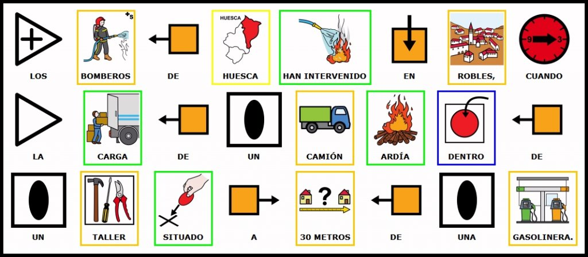
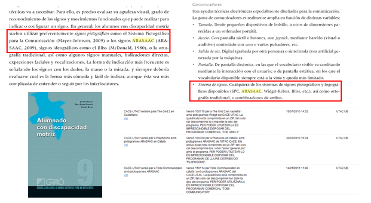

# 6.2 Evolución

Partiendo de las características que definen a cualquier lenguaje, ARASAAC ha ido evolucionando y creciendo como **lenguaje pictográfico** a lo largo de sus más de seis años de vida, siendocapaz de representar cualquier texto e idea compleja gracias a sus más de **9500 pictogramas** únicos (cerca de 15.500 si tenemos en cuenta las distintas acepciones) y a sus características, que lo hacen único entre el resto de sistemas pictográficos existentes.

A continuación podéis ver un ejemplo práctico que demuestra como ARASAAC permite expresar cualquier idea o información es la subtitulación de **noticias de Aragón Radio 2** de las que os ponemos un ejemplo a continuación.

Se puede afirmar que, paralelamente a la evolución de ARASAAC como lenguaje de comunicación por pictogramas, ha ido creciendo el reconocimiento de éste como sistema pictográfico de comunicación por profesionales de reconocido prestigio en el mundo de los SAACs como Carme Basil, Emili Soro-Camats y Carme Russell.

Fuera de España, organismos internacionales como el ISAAC Internacional o ISAAC Brasil han reconocido a ARASAAC como sistema pictográfico de comunicación invitándole a diferentes eventos y congresos.

El reconocimiento de profesionales y organismos de los SAAC se ve refrendado, en último término, por el apoyo, difusión y uso que, de ARASAAC, hacen miles de profesionales y familias dentro y fuera de España.

## Para Saber Más

Si deseáis conocer un poco más en profundidad el proyecto de subtitulación de noticias de AragónRadio 2 podéis visitar la información proporcionada en la Sección"Ejemplos de Uso" de ARASAAC ([http://arasaac.org/ejemplos_uso.php?id_eu=5](http://arasaac.org/ejemplos_uso.php?id_eu=5)) y la web de AragónRadio 2 dónde se publican las noticias ([http://www.aragonradio2.com/catedu](http://www.aragonradio2.com/catedu)).

