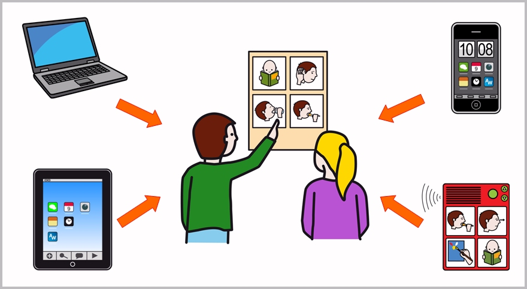

# M2: Usamos las NNTT para comunicarnos y adaptar materiales

## Introducción del módulo

Las **nuevas tecnologías de la información y la comunicación** están presentes en nuestra vida diaria y se han convertido en **elementos imprescindibles para la realización de muchas tareas cotidianas**. No sólo nos facilitan un mayor bienestar, sino que también están cambiando nuestra forma de trabajar, de acceder a la información, incluso de relacionarnos con el resto de las personas o de utilizar nuestro tiempo de ocio.

No vamos a entrar en los aspectos positivos o negativos que conllevan el uso de estas tecnologías, porque no es el motivo de reflexión de esta introducción, pero es evidente que la aparición de **ordenadores, tabletas, teléfonos inteligentes, etc.**, han supuesto un fuerte **impacto en nuestra sociedad** y la evolución tecnológica de todos estos dispositivos no deja de sorprendernos y abrumarnos. Resulta casi imposible estar al día de todo lo que acontece a su alrededor.

Sin duda, uno de los aspectos más positivos de esta revolución tecnológica ha sido su **plena integración en el ámbito de la diversidad funcional** para conseguir una mayor autonomía de las personas que presentan algún tipo de dificultad a nivel visual, auditivo, motriz o cognitivo. Teclados que permiten navegar por Internet a personas con baja visión, pantallas con traducción simultánea por reconocimiento de voz para personas sordas, teclados y ratones virtuales para personas con movilidad reducida o multitud de programas adaptados de acceso al currículo para personas que necesitan de adaptaciones curriculares.

Podríamos poner multitud de ejemplos sobre distintos usos de las nuevas tecnologías en este ámbito en el que, al requerir los usuarios unas necesidades muy específicas de adaptación, se ha conseguido alcanzar muchos avances generalizables a otros campos.

En lo que se refiere a la **comunicación aumentativa y alternativa**, además de los comunicadores y aplicaciones comerciales, se trabaja desde hace varios años en el **diseño, elaboración y testaje de productos de apoyo y aplicaciones informáticas** que faciliten la comunicación de todas personas y la elaboración y adaptación de materiales específicos.

Existen, actualmente, **un gran abanico de aplicaciones que permiten comunicarse de forma funcional** a través de cualquier dispositiv o(ordenador, tablet o smartphone), que nos ayudan a **traducir textos a pictogramas oque sirven para establecer rutinas cotidianas**, anticipando los distintos pasos que debemos seguir para la realización de una acción.

Gracias a que muchas de estas aplicaciones utilizan los recursos de [ARASAAC](http://arasaac.org/), podemos elegir entre una serie de aplicaciones con un alto nivel de calidad y usabilidad para utilizar con nuestros usuarios y sin coste económico alguno, gracias a las [condiciones de uso](http://arasaac.org/condiciones_uso.php) que establece el **Gobierno de Aragóna** tal efecto.

Uno de ellos es, por ejemplo,[ PICAA](http://asistic.ugr.es/picaa/) al que vamos a ver en este vídeo actuando como Comunicador Dinámico.

https//www.youtube.com/watch?v=fidDmGXJiRA

Además, para las personas con discapacidad, la utilización de las NNTT ayudan a potenciar sus capacidades y posibilitan realización de otras tareas y el acceso a servicios indispensables, siempre que estas herramientas, en su diseño y desarrollo, cumplan los criterios y normas de accesibilidad y usabilidadexigibles.

## Objetivos

Los objetivos que se pretenden alcanzar en este módulo son:

* Conocimiento y manejo práctico de aplicaciones informáticas para PC y para dispositivos relacionadas con la CAA y que utilizan los recursos del portal ARASAAC:
    * **AraWord**: procesador de textos con pictogramas.
    * **AraBoard**: comunicador multiplataforma.
    * **Conocimiento básico de otras aplicaciones**: Comunicador CPA, Pictogramagenda, Pictodroid, ...

## Contenidos

Este módulo se divide en las siguientes unidades:

- **Unidad 1**: Uso de las nuevas tecnologías como soporte de apoyo a la comunicación: comunicadores electrónicos y aplicaciones informáticas para ordenadores y dispositivos móviles.
- **Unidad 2**: AraBoard, comunicador multiplataforma para PC y dispositivos móviles: generación de tableros de comunicación y otro tipo de actividades.
- **Unidad 3**: AraWord, procesador de textos mediante pictogramas para la elaboración y adaptación de materiales para la CAA.

