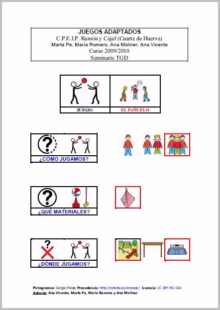
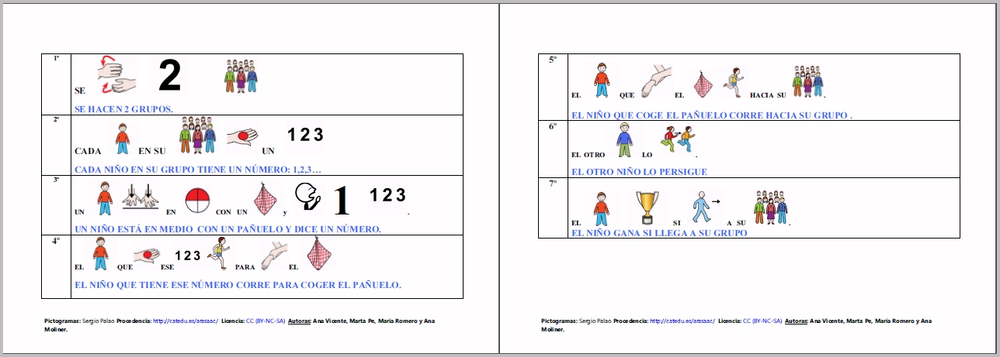

# M3: Jugamos y nos divertimos con pictogramas

**Introducción del módulo**

El **juego** es una de las actividades más primarias que desarrolla el ser humano desde las primeras etapas de su vida y&nbsp;una de las actividades más importantes en la edad infantil. Los ni&ntilde;os no solo utilizan el juego para **divertirse**, sino que también lo hacen para** estimular su desarrollo intelectual**, desarrollar su **creatividad**, aprender a** controlar su propio cuerpo**, expresar **emociones** y favorecer la **socialización**.&nbsp;

Todo el mundo coincide en la necesidad del** juego **como fuente de** crecimiento, aprendizaje y socialización **y, por lo tanto, como una vía mediante la cual** el ni&ntilde;o ensaya la forma de actuar ante el mundo**.

<td style="text-align: center;"><pre>Fig. 3.1"Diferentes etapas del juego a lo largo de nuestra vida"</pre><pre>**Pictogramas: **ARASAAC** Licencia: **CC (BY-NC-SA)</pre></td>

Su importancia es tal que el&nbsp;**Artículo 31&nbsp;**de la**&nbsp;Convención de los Derechos de ni&ntilde;os y ni&ntilde;as**&nbsp;(adoptada por la asamblea general de las Naciones Unidas, el 20 de noviembre de 1989) recoge**:&nbsp;**&ldquo;Se reconoce el derecho del ni&ntilde;o al descanso y al esparcimiento, al juego y a las actividades recreativas propias de su edad y a participar libremente en la vida cultural y en las artes. Se respetarán y promoverán el derecho del ni&ntilde;o a participar plenamente en la vida cultural y artística y se propiciarán oportunidades apropiadas, en condiciones de igualdad, de participar en la actividad cultural, artística, recreativa y de esparcimiento&rdquo;.

Evidentemente, la** comunicación **juega un papel muy importante en este tipo de actividad y las barreras en la comunicación impiden, en muchas ocasiones, que las personas tomen parte activa en juegos y actividades de ocio con sus compa&ntilde;eros o amigos. Por lo tanto, los profesionales y las familias deberemos tomar las** medidas compensatorias adecuadas **para eliminar esta barrera y dirigir nuestras** actuaciones&nbsp;tanto a la persona como a su entorno**, incluyendo a todas las personas y todos los contextos donde pueden desarrollarse estas actividades l&uacute;dicas.

Este tipo de medidas compensatorias que deberemos adoptar, entre otras, en el área de comunicación para conseguir la participación plena de todas las personas deberán ir dirigidas a la a**daptación del propio juego **con pictogramas, la utilización de** carteles explicativos de las reglas básicas **del mismo, la creación de** rutinas o guiones sociales **que sirvan de anticipación sobre la participación y la elaboración de** tableros o libros de comunicación**, que permitan expresar cualquier emoción, deseo o necesidad para conseguir su plena inclusión en la actividad.&nbsp;

<td style="text-align: center;"><pre>Fig. 3.2 [Tablero de comunicación](http://informaticaparaeducacionespecial.blogspot.com.es/p/tableros-de-comunicacion.html) de 12 casillas para la elección del juego cooperativo en el que queremos participar.</pre><pre>**Autores: **José Manuel Marcos y Nuria Lázaro** Licencia: **CC (BY-NC-SA)</pre></td>

A continuación, podemos ver en la imagen inferior una** adaptación **con pictogramas de ARASAAC del"**Juego del pa&ntilde;uelo**".

<td style="text-align: center;"><pre>Fig. 3.3 Presentación con pictogramas de los elementos necesarios para jugar al"[**Juego del pa&ntilde;uelo**](http://arasaac.org/materiales.php?id_material=225)"</pre><pre>**Autores:** Ana Vicente, Ana Moliner, María Romero y Marta Pe **Licencia:** CC (BY-NC-SA)</pre></td>

Tras la presentación de todos los elementos (participantes, materiales y espacios), podemos visualizar las **reglas adaptadas** con pictogramas para conseguir la plena participación de todos.

<td style="text-align: center;"><pre>Fig. 3.4 Reglas básicas adaptadas con pictogramas para jugar al"[**Juego del pa&ntilde;uelo**](http://arasaac.org/materiales.php?id_material=225)"</pre><pre>**Autores: **Ana Vicente, Ana Moliner, María Romero y Marta Pe** Licencia: **CC (BY-NC-SA)</pre></td>

De esta forma, además de la inclusión, conseguiremos que el juego sea una** experiencia muy positiva **para todos y, sobre todo,** divertida y l&uacute;dica**.

Las **actividades de ocio** también forman una parte importante de nuestra vida personal y social. La aparición de los pictogramas ARASAAC ha favorecido la **adaptación con pictogramas de distintas actividades** que también nos ayudan a desarrollarnos plenamente como personas y como integrantes de la sociedad en la que vivimos.

Una de las actividades que más auge ha tenido a lo largo de estos a&ntilde;os ha sido la **adaptación a pictogramas** de vídeos con **canciones famosas** de los artistas más reconocidos o de películas infantiles, que nos puede servir para utilizarlos como karaoke y potenciar el refuerzo del lenguaje oral en una actividad de ocio muy concreta.

A continuación, podemos observar un ejemplo de adaptación con pictogramas de ARASAAC de una de las canciones de la película"**El rey León**".

https//www.youtube.com/watch?v=pQqRdfhdPRY
Pero las adaptaciones han ido más allá de la m&uacute;sica y, en estos momentos, los profesionales y las familias han apostado por utilizar los sistemas de comunicación en otros campos que, hace a&ntilde;os, hubiera resultado impensable. Aquí podemos visualizar**&nbsp; **un** anuncio con pictogramas**.

&nbsp;

https//www.youtube.com/watch?v=zoJ0Cq8L5S8
&nbsp;

Os invitamos a **reflexionar sobre situaciones de nuestra vida cotidiana** en las que las personas con dificultades en la comunicación encuentran barreras que dificultan su plena integración. A modo de ejemplo, podéis visitar&nbsp;nuestro apartado de&nbsp;**[Ejemplos de uso](http://arasaac.org/ejemplos_uso.php)**, donde encontraréis más situaciones en las que se han realizado adaptaciones de todo tipo, cuyo objetivo es **mejorar la calidad de vida de todas las personas**. Pero no nos enga&ntilde;emos, todavía queda mucho por hacer y es fundamental que todos -profesionales, familias e instituciones- &nbsp;participemos conjutnamente en esta labor.

## ParaSaberMas

Para conocer como conformar la conducta del juego paso a paso en personas con autismo, es muy recomendable la lectura de&nbsp;[**El libro del juego**](http://arasaac.org/materiales.php?id_material=297), En este libro, Anabel Cornago ([El sonido de la hierba al crecer](http://elsonidodelahierbaelcrecer.blogspot.com/)) nos muestra todos los ejercicios y estrategias que ha seguido con su hijo Erik para lograr interacción, juego funcional, atención compartida, juego de reglas, juego con otros ni&ntilde;os, juego símbólico, modificación de conductas inadecuadas y de estereotipias, así como habilidades sociales. En el libro, aparecen enlazados muchos materiales que Anabel ya ha compartido con el portal ARASAAC.&nbsp;

Podéis encontrar más vídeos de canciones subtituladas con pictogramas de ARASAAC en** Youtube **buscando por los términos clave:&nbsp;**["Canciones ARASAAC"](http://www.youtube.com/results?search_query=canciones+arasaac)&nbsp;**o**&nbsp;["Canciones con pictogramas"](http://www.youtube.com/results?search_query=canciones+con+pictogramas&amp;oq=canciones+con+pictogramas&amp;gs_l=youtube.3..0l4.84.5783.0.5925.30.21.2.7.7.0.138.2178.7j14.21.0...0.0...1ac.1.11.youtube.26t6Ela8sD8).**

Para ver otros anuncios adaptados con pictogramas os recomendamos visitar el perfil de [**CarmenPi** ](http://www.youtube.com/user/carmenpi100)en **Youtube**.

## Objetivos

Los objetivos que se pretenden alcanzar en este módulo son:

- Manejar de modo práctico los distintos** sistemas de b&uacute;squeda **de recursos gráficos (pictogramas, fotografías y videos en LSE) para la elaboración de materiales de Comunicación Aumentativa y Alternativa (CAA) y adaptaciones curriculares.
- Manejo práctico de los sistemas de b&uacute;squeda de materiales elaborados por los propios usuarios, &nbsp;en función de distintas variables: tipo, nivel curricular, usuarios, idioma, etc.
- Acceso a las** herramientas online **del portal y a sus** carpetas **asociadas:** &ldquo;Mi selección&rdquo; **y** &ldquo;Carpeta de trabajo&rdquo;**.
<li>E**laboración de materiales **con las** herramientas online **disponibles en el portal:
<ul>
- Creador de Animaciones,
- Creador de Símbolos,
- Creador de Frases,
- Generador de Horarios,
- Generador de Calendarios,
- Generador de Tableros (quizá no sea necesario explicarla)
- Generador de Bingos ydominós
- Generador de Juego de la Oca.

**Contenidos**

El módulo se divide en los siguientes unidades:

-** Unidad 1:**&nbsp;Importancia del Juego
- **Unidad 2:**&nbsp;Utilización de los diferentes sistemas de b&uacute;squeda de recursos gráficos en el portal ARASAAC: b&uacute;squeda inicial y en los diferentes catálogos.
-** Unidad 3:**&nbsp;Adición de recursos gráficos a&nbsp; la carpeta &ldquo;Mi selección&rdquo; para su utilización en la elaboración de materiales con las herramientas on line disponibles en el portal.
- **Unidad 4:**&nbsp;Importación de recursos gráficos propios a la &ldquo;Carpeta de trabajo&rdquo;, con el mismo fin.
-** Unidad 5:**&nbsp;Generador de Bingos.
- **Unidad 6:**&nbsp;Generador del Juego de la Oca.
-** Unidad 7:**&nbsp;Generador de Dominós
- **Unidad 8:**&nbsp;Generador de Dominós encadenados.
-** Unidad 9:**&nbsp;Creador de Animaciones.
- **Unidad 10:**&nbsp;Creador de Frases.

