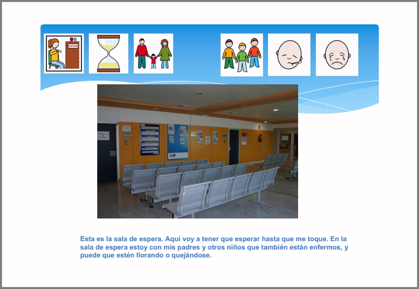

# U1. Importancia de la estructuración del espacio y del tiempo

El entorno en el que nos desenvolvemos se organiza de forma que constantemente&nbsp;nos proporciona información. Esta información aprendemos a interpretarla de forma natural&nbsp;a lo largo de la vida. Pero no ocurre así con los ni&ntilde;os con importantes alteraciones en eldesarrollo, como es el caso de los ni&ntilde;os con autismo, por ejemplo.&nbsp;Esta incomprensión del entorno da lugar con frecuencia a problemas de&nbsp;comportamiento. Por lo que surge la necesidad de dise&ntilde;ar el entorno físico (aula, centro&nbsp;educativo, casa) de forma estructurada, para facilitar al alumno autista, una organización del&nbsp;espacio y el tiempo que favorezca y fomente la comunicación, la anticipación y la predicción&nbsp;de la actividad futura, así como el recuerdo de la actividad pasada y tomar conciencia de la&nbsp;actividad presente.

La presentación de la realidad mediante fotografías o pictogramas, resulta una&nbsp;metodología muy efectiva para trabajar con ni&ntilde;os con TGD.&nbsp;

Esta estimulación la vamos a realizar a través de claves estimulares,&nbsp;preferentemente visuales, pero también auditivas, táctiles, etc, dirigidas a dos dimensiones&nbsp;fundamentales; ordenación del espacio y ordenación del tiempo.

**Ordenación del espacio:**

- Realizar **adaptaciones en el espacio del aula**, haciendo una distribución en&nbsp;zonas o espacios dedicados al trabajo de determinadas actividades, por&nbsp;ejemplo; rincón de juegos, rincón de los cuentos, rincón de relajación etc.
- Utilizar** claves visuales: **ayuda a los ni&ntilde;os con TGD a mejorar la comprensión social, para que puedan desenvolverse de forma autónoma. Sirven para se&ntilde;alar las actividades a realizar en un rincón, en una jornada concreta, permitiendo a todos los ni&ntilde;os y ni&ntilde;as una participación activa, especialmente si se anticipan los cambios. Los sistemas de anticipación están íntimamente relacionados con el sentido de la acción, las personas con TGD, incluso las más capaces tienen dificultades para organizar las secuencias de acción siguiendo un plan concreto.
-** Disponer los materiales de forma clara y ordenada**, no sólo en el aula, sino en todo el centro.

&nbsp; &nbsp; &nbsp; &nbsp; Las ayudas o claves visuales para ordenar el espacio son:

- **Pictogramas:** y claves de se&ntilde;alización para diferentes espacios. (Aulas, comedor, talleres, psicomotricidad, logopedia, orientación etc.).
- Símbolos o **cárteles para cada dependencia**, así como las fotos de las personas que están en cada una de ellas.
-** Líneas de colores **o cintas de belcro: para indicar recorridos, para acceder a ciertas dependencias, para marcar límites o delimitar espacios, ayudas que progresivamente iremos desvaneciendo, una vez las respeten y entiendan.

<td style="text-align: center;"><pre class="seccion">Fig. 4.1 [Adaptación del entorno hospitalario del Hospital Puerta de Hierro para pacientes con TEA](http://www.madrid.org/cs/Satellite?cid=1354213907310&amp;language=es&amp;pagename=HospitalPuertaHierroMaja%2FPage%2FHPHM_contenidoFinal)</pre></td>

&nbsp;

**Ordenación del tiempo:**

-** Agenda:**&nbsp;secuencia de las acciones principales de la jornada, a través de símbolos y claves visuales. Son como relojes adaptados que permiten conocer y predecir los acontecimientos que tendrán lugar durante la jornada escolar.
- **Agendas de aula:**&nbsp;- Fotografías, fotografías y pictogramas, y pictogramas.
-** Agendas individuales;**&nbsp;adaptadas a las posibilidades de cada ni&ntilde;o, desde ni&ntilde;os muy afectados a ni&ntilde;os de alto nivel o funcionamiento.

<td style="text-align: center;"><pre>Fig. 4.2 Ejemplo de [Agenda escolar ](http://arasaac.org/materiales.php?id_material=739)realizada por el **CPEE Alborada**</pre></td>

&nbsp;

**Fuente** ([http://diversidad.murciaeduca.es/publicaciones/cee/doc/5_2.pdf](http://diversidad.murciaeduca.es/publicaciones/cee/doc/5_2.pdf))

&nbsp;

**Experiencia práctica del trabajo de la orientación espacial y temporal en el aula**:&nbsp;

[http://ardilladigital.com/DOCUMENTOS/TECNOLOGIA%20EDUCATIVA/TEACCH/Estructuracion%20espacio-temporal%20en%20un%20aula%20de%20autismo%20-%20Velasco%20-%20art.pdf](http://ardilladigital.com/DOCUMENTOS/TECNOLOGIA%20EDUCATIVA/TEACCH/Estructuracion%20espacio-temporal%20en%20un%20aula%20de%20autismo%20-%20Velasco%20-%20art.pdf)&nbsp;
|<iframe style="display: block; margin-left: auto; margin-right: auto;" src="//player.vimeo.com/video/63580513" frameborder="0" width="500" height="334"></iframe>[S&Iacute;, ESTOY AQU&Iacute;](http://vimeo.com/63580513) from [lelesyesther](http://vimeo.com/user17210288) on [Vimeo](https://vimeo.com).
|&nbsp;

