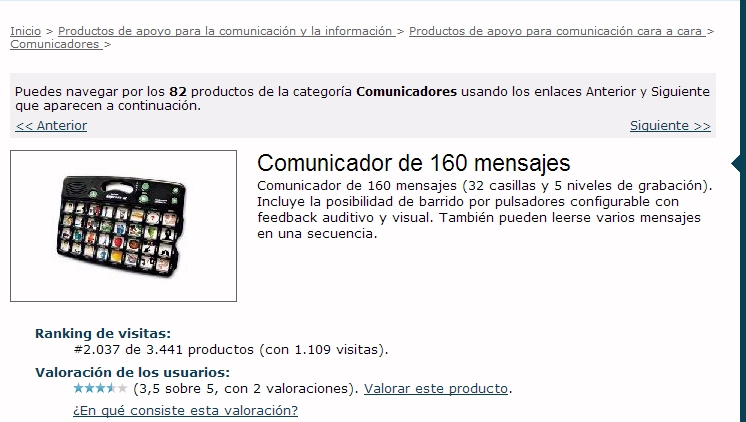
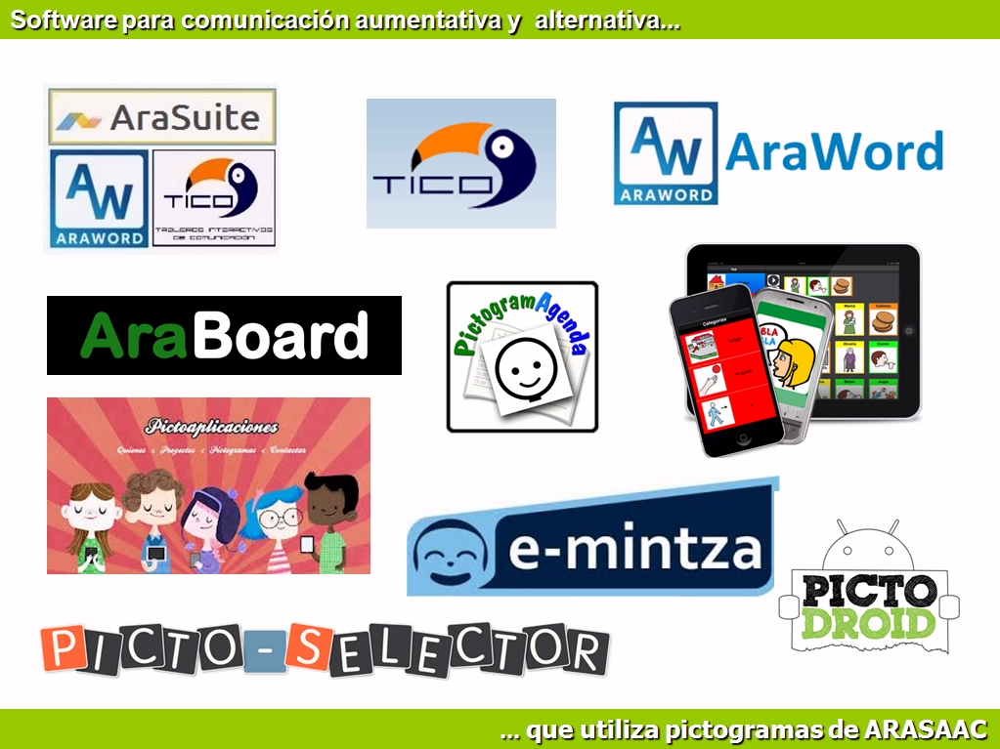
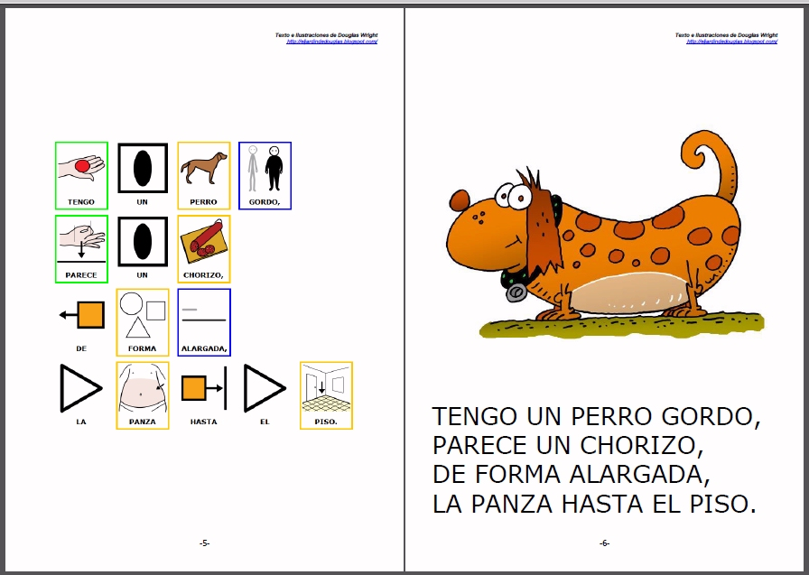
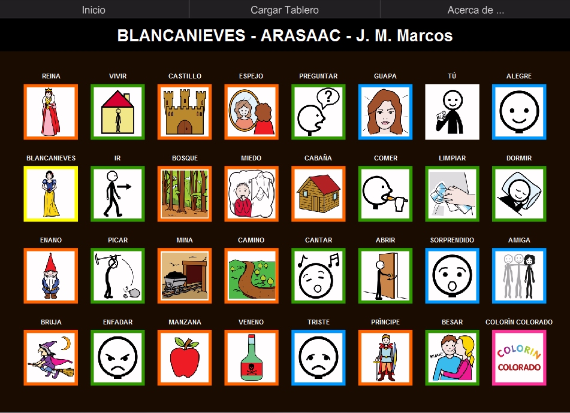
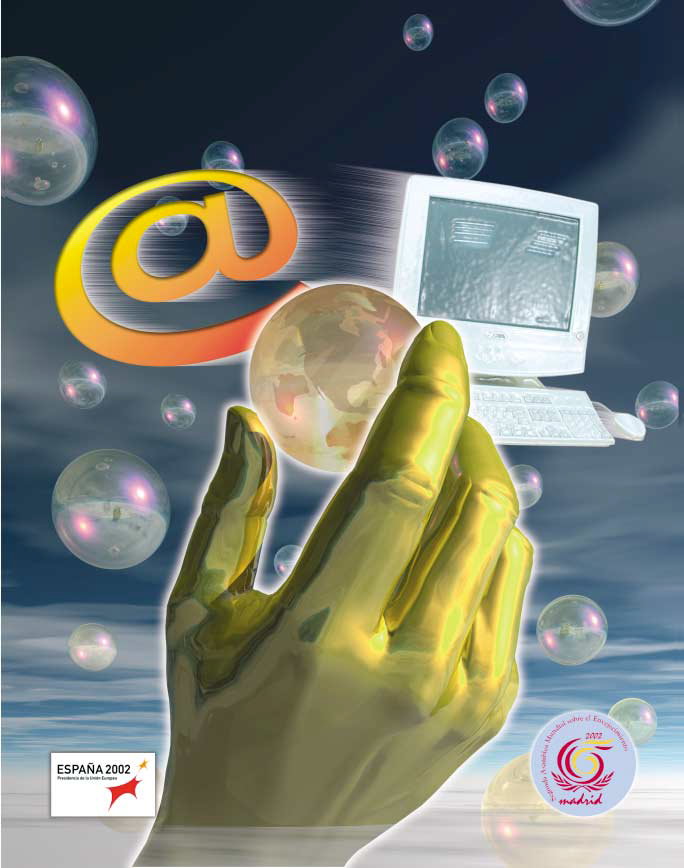

# U1. Uso de las NNTT como soporte de apoyo a la comunicación

Como hemos comentado anteriormente, el uso de las NNTT en el ámbito de la educación especial y, sobre todo en el campo de la comunicación aumentativa y alternativa, ha permitido desarrollar productos de apoyo para romper y superar barreras en la comunicación, en el acceso al currículo, en el aprendizaje de rutinas, etc. Son productos que nos ayudan mejorar la calidad de vida de las personas y su autonomía personal y social, permitiéndoles desenvolverse de una forma adecuada en su entorno habitual.

Además de las ayudas básicas para la comunicación, como  son lostableros y de los cuadernos de comunicación aumentativa y alternativa, también podemos encontrar otros productos de apoyo que cumplen estos objetivos:

- **Ayudas de alta / baja tecnología:** dispositivos portátiles que, mediante el uso de voz sintetizada o voz grabada, permiten al usuario emitir un mensaje en voz alta, expresando así sus necesidades, deseos, emociones, etc. En la mayoría de este tipos de ayudas, se incorpora la opción de barrido automático o secuencial, por lo que pueden ser utilizadas por personas con movilidad reducida que dispongan de un elemento de acceso como un pulsador, conmutadores, joystick, etc.). 

-** ****Ayudas basadas en sistemas de software**: aplicaciones informáticas para distintos dispositivos móviles (ordenador, tablet o teléfono inteligente), que permiten al usuario comunicarse a través de imágenes, pictogramas o mediante la utilización de grafías,  palabras o frases. También incluímos en este tipo de ayudas, a aquelllas aplicaciones que nos permiten adaptar textos a pictogramas, facilitando la elaboración de materiales de comunicación aumentativa y alternativa.

Dentro de la gama de comunicadores existentes en el mercado, podremos encontrar **ayudas de baja tecnología** (libros electrónicos, Go Talk, Supertalker, etc.) y **ayudas de alta tecnología **(Chatbox, Lightwriter, Alphatalker, etc.)**.**

Para visualizar distintos tipos de** ayudas de alta / baja tecnología**, podéis entrar en el catálogo de [Catálogo de Productos de Apoyo del CEAPAT](http://www.ceapat.es/ceapat_01/cat_apo/catalogo/index.htm) y escribir en el cuadro de búsqueda **"Comunicador"** o por el **nombre del comunicador**, como los citados anteriormente. Entre los resultados que aparecen, podréis conocer y visualizar una gran cantidad de productos, así como sus características técnicas y valoración de los usuarios sobre los mismos.

<td style="text-align: center;"><pre>Fig. 2.2 Ejemplo de comunicador portatil. </pre></td>

En el ámbito de la** tecnología de ayuda basada en sistemas de software**, podemos encontrar **aplicaciones de pago** (Boardmaker, Comunicate In Print 2, Writing whit symbols 2000, etc.) y **aplicaciones de libre distribución** (AraWord, Proyecto TICO, AraBoard, Comunicador CPA, etc.), es decir, aplicaciones sin coste económico alguno para el usuario.

En la siguiente imagen, podréis visualizar distintos** programas informáticos de comunicación **para** PC **y para** dispositivos móviles **que usan pictogramas de [ARASAAC](http://arasaac.org/) y cuyas licencias permiten que sean utilizados de forma gratuita.

<td style="text-align: center;"><pre>Fig. 2.3 Relación de programas informáticos para comunicación aumentativa y alternativa en castellano**Autores:** José Manuel Marcos y David Romero</pre></td>

En las dos próximas unidades de este capítulo, conoceremos y trabajaremos sobre dos aplicaciones para la comunicación aumentativa y alternativa, enmarcadas dentro del software libre ([**AraWord**](http://arasuite.proyectotico.es/index.php?title=AraWord) y [**AraBoard**](http://giga.cps.unizar.es/affectivelab/araboard.html)) y que han sido desarrolladas por el **Departamento de Informática e Ingeniería de Sistemas** y el grupo **Giga Affective Lab** del [**Centro Politécnico Superior**](https://eina.unizar.es/) de la **Universidad de Zaragoza.**

<td style="text-align: center;"><pre>Fig. 2.4 Ejemplo de adaptación de una poesía de [Douglas Wright](http://arasaac.org/materiales.php?id_material=578) con AraWord</pre><pre>**Autores:** José Manuel Marcos y David Romero **Licencia:** CC (BY-NC-SA)</pre></td>

 

<td style="text-align: center;"><pre>Fig. 2.5 [Ejemplo de un tablero de comunicación realizado con AraBoard](http://arasaac.org/materiales.php?id_material=755)</pre><pre>**Autores: **David Romero** Licencia: **CC (BY-NC-SA)</pre></td>

## Tarea

Para conocer mejor qué es el software de comunicación vamos a leer algunas partes de estos libros:

-"[**Mi Software de Comunicación**](http://www.ceapat.es/InterPresent2/groups/imserso/documents/binario/softwarecomunicacion.pdf)" Páginas 11 a 84.
-"[Comunicación Aumentativa y Alternativa](http://www.ceapat.es/InterPresent2/groups/imserso/documents/binario/comunicacinaumentativayalterna.pdf)" (pag. 11 y 12)
-"[Pluridiscapacidad y contextos de intervención](http://diposit.ub.edu/dspace/bitstream/2445/33059/7/Pluridiscapacidad_contexto_131030_.pdf)" Capítulo 7, Páginas 131 a 148.

## ParaSaberMas

Para ampliar conocimientos acerca del uso de la tecnología en la atención a personas con diversidad funcional os recomendamos este número de la revista [**MINUSVAL**](http://sid.usal.es/minusval.aspx?ID=2002esp1) del IMSERSO

<td style="text-align: center;"><pre>Fig. 2.6 Portada de la revista [Minusval](http://sid.usal.es/minusval.aspx?ID=2002esp1) de Junio de 2002</pre></td>

