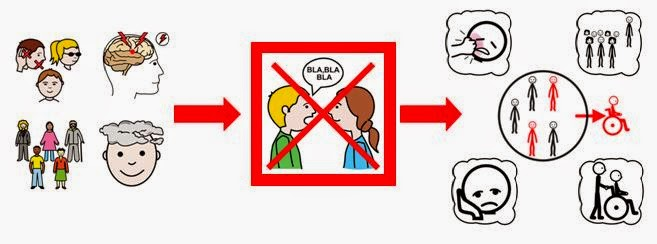

# U2. Barreras en la comunicación funcional

Antes de hablar de las barreras de la comunicación, vamos a contextualizarlas en situaciones concretas que deben ser superadas por cualquier persona para lograr la plena inclusión en la sociedad.

https//www.youtube.com/watch?v=SlL82tlb--M

*Video: "Rompiendo Barreras" - Autores: Cristina López Dumall, Elena Marcos Lázaro, Margarita Montañés Hijazo, Marta Monzón Córdova, Santiago Peribáñez Faguas, Laura Sabater Zamora y Gema Urbina Moreno.*

La comunicación, aun siendo algo intrínseco a la condición humana y una habilidad que desarrollamos gracias al contacto social desde el nacimiento, no siempre se desarrolla de manera adecuada.

Hay personas que por distintos **factores** (congénitos, prenatales, accidentes cerebrovasculares, traumatismos, etc.) presentan graves **dificultades para comunicarse** de la forma habitual. En estos casos, la comunicación se convierte en una **BARRERA** que ocasiona conductas agresivas en algunos casos, el aislamiento del sujeto en general, la pérdida de la autonomía personal y, finalmente, la dependencia de terceras personas para la realización de cualquier actividad.

Junto con esta realidad, tenemos que pensar también en aquellas personas que, aun no teniendo ninguno de estos factores congénitos o adquiridos, tienen problemas para comunicarse por proceder de otros países y desconocer nuestro idioma.

En definitiva estas barreras en la comunicación dificultan la plena integración de estas personas en la sociedad en la que conviven.

