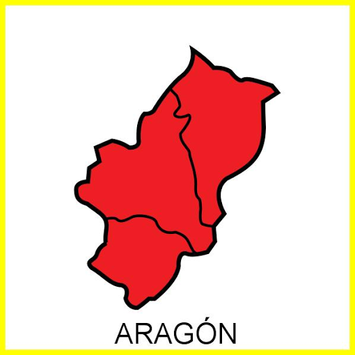
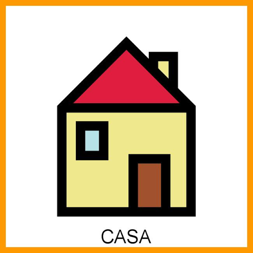
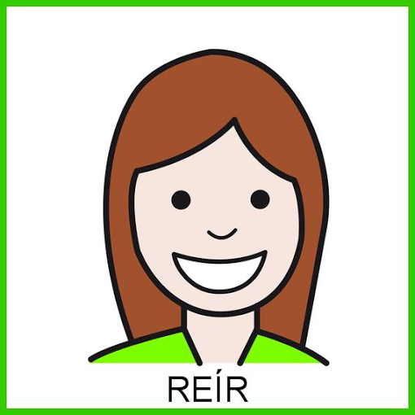
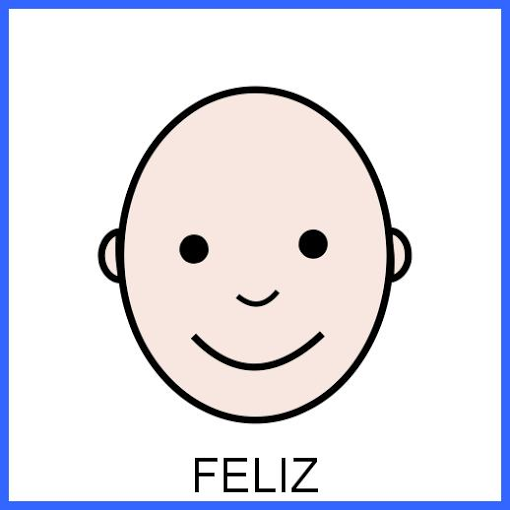
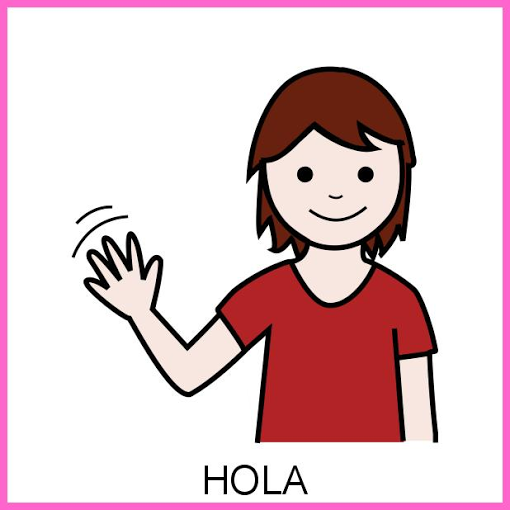
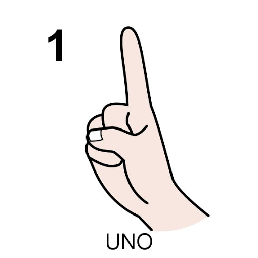
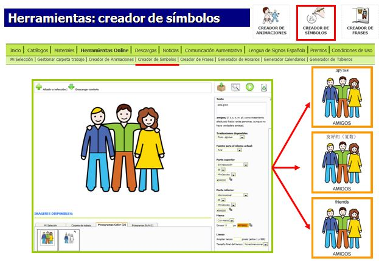

# U2. Creador de Símbolos

El **"Creador de Símbolos"** tiene como finalidad modificar y adaptarlas distintas variables que componen los pictogramas (idioma, texto asociado, formato general, etc.) a las necesidades de los usuarios.

Dentro de las variables que podemos configurar en la herramienta está el código de color del marco, que, en el caso de usuarios de sistemas de CAA les ayuda a identificar cada elemento gramatical que compone la frase y, por tanto, facilitar el aprendizaje de la morfosintaxis.

Los códigos de color responden a un estandard internacionalmente reconocido:

Otra de las variables que pueden ser configuradas, además del color del marco, es el texto superior e inferior del pictograma. Dentro de la posibilidad que existe de poner texto en la parte superior o inferior del pictograma podemos configurar el idioma de ambos textos y variables como el tamaño de texto, mayúsculas/minúsculas, color del texto,...

Podemos ver un ejemplo de símbolos biling&uuml;es en la captura de pantalla a continuación.

Finalmente, señalar, que al igual que otras herramientas online, el Creador de Símbolos permite utilizar los pictogramas de ARASAAC, fotográficas en LSE o imágenes subidas por el usuario a la"carpeta de trabajo".

## Importante

Para aprender el funcionamiento de esta herramienta se puede consultar el manual en:

[http://arasaac.org/zona_descargas/documentacion/manual_creador_simbolos_es.pdf](http://arasaac.org/zona_descargas/documentacion/manual_creador_simbolos_es.pdf)

