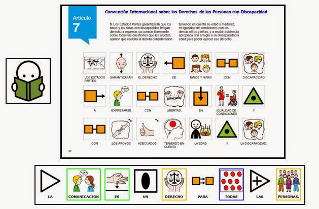
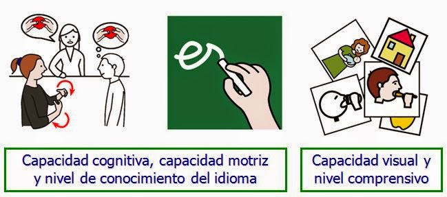

# U3. Conocimiento de diferentes SAACs

El artículo 7 de la [Convención de Derechos de las Personas con Discapacidad](http://www.ceapat.es/ceapat_01/centro_documental/tecnologiasinformacion/sistemas_comunicacion_aumentativa/IM_035263) establece que, con el fin de garantizar el derecho a la comunicación, se ofrecerá la asistencia necesaria y apropiada a cada persona y sus necesidades.

Dentro de las medidas que se aplican para superar las barreras comunicativas y garantizar el derecho a la comunicación, existen los **Sistemas de Comunicación Aumentativa o Alternativa (SAAC)**.

> Los **Sistemas Aumentativos y Alternativos de Comunicación (SAAC)** son formas de expresión distintas al lenguaje hablado, que tienen como objetivo aumentar (aumentativos) y/o compensar (alternativos) las dificultades de comunicación y lenguaje de muchas personas con discapacidad.

> La comunicación y el lenguaje son esenciales para todo ser humano, para relacionarse con los demás, para aprender, para disfrutar y para participar en la sociedad y hoy en día, gracias a estos sistemas, no deben verse frenados a causa de las dificultades en el lenguaje oral. Por esta razón, todas las personas, ya sean niños, jóvenes, adultos o ancianos, que por cualquier causa no han adquirido o han perdido un nivel de habla suficiente para comunicarse de forma satisfactoria, necesitan usar un SAAC.

> Entre las causas que pueden hacer necesario el uso de un SAAC encontramos la parálisis cerebral (PC), la discapacidad intelectual, los trastornos del espectro autista (TEA), las enfermedades neurológicas tales como la esclerosis lateral amiotrófica (ELA), la esclerosis múltiple (EM) o el párkinson, las distrofias musculares, los traumatismos cráneo-encefálicos, las afasias o las pluridiscapacidades de tipologías diversas, entre muchas otras.

> La **Comunicación Aumentativa y Alternativa (CAA)** no es incompatible sino complementaria a la rehabilitación del habla natural, y además puede ayudar al éxito de la misma cuando éste es posible. No debe pues dudarse en introducirla a edades tempranas, tan pronto como se observan dificultades en el desarrollo del lenguaje oral, o poco después de que cualquier accidente o enfermedad haya provocado su deterioro. No existe ninguna evidencia de que el uso de CAA inhiba o interfiera en el desarrollo o la recuperación del habla.

Autora: Carmen Basil Fuente: [ARASAAC](http://arasaac.org/aac.php)

> La Comunicación Aumentativa y Alternativa incluye diversos **sistemas de símbolos**, tanto gráficos (fotografías, dibujos, pictogramas, palabras o letras) como gestuales (mímica, gestos o signos manuales) y, en el caso de los primeros, requiere también el uso de **productos de apoyo**. Los diversos sistemas de símbolos se adaptan a las necesidades de personas con edades y habilidades motrices, cognitivas y lingüísticas muy dispares.

> Los **productos de apoyo para la comunicación** incluyen recursos tecnológicos, como los comunicadores de habla artificial o los ordenadores personales y tablets con programas especiales, que permiten diferentes formas de acceso adaptadas algunas para personas con movilidad muy reducida, y facilitan también la incorporación de los diferentes sistemas de signos pictográficos y ortográficos, así como diferentes formas de salida incluyendo la salida de voz. También pueden consistir en recursos no tecnológicos, como los tableros y los libros de comunicación.

> Para acceder a los ordenadores, comunicadores, tableros o libros de comunicación existen diversas estrategias e instrumentos denominados genéricamente **estrategias y productos de apoyo para el acceso**, tales como los punteros, los teclados y ratones adaptados o virtuales o los conmutadores.

Autora: Carmen Basil. Fuente: [ARASAAC](http://arasaac.org/aac.php)

Teniendo presentes los diferentes SAAC existentes, debemos optar por aquel más adecuado a las características individuales de cada persona, teniendo en cuenta criterios como la capacidad cognitiva, motriz y visual, así como el nivel de conocimiento del idioma o el nivel de comprensión del usuario final.

> Tanto para los sistemas de símbolos gestuales como para los gráficos encontramos una gradación desde sistemas muy sencillos, que se adaptan a personas con déficits cognitivos y lingüísticos de diversa consideración, hasta sistemas complejos que permiten niveles avanzados de lenguaje signado (basado en signos manuales) o asistido (basado en signos gráficos).

> En el caso de los símbolos gestuales, esta gradación abarca desde el uso de mímica y gestos de uso común hasta el uso de signos manuales, generalmente en el orden correspondiente al lenguaje hablado; es lo que se denomina lenguaje signado o bimodal. Las lenguas de signos utilizadas por las personas no oyentes no se consideran SAAC, ya que constituyen idiomas que se han desarrollado y se adquieren de forma natural, al igual que ocurre con el lenguaje hablado. El uso de signos manuales requiere disponer de habilidades motrices suficientes, como puede ser el caso de personas con discapacidad intelectual o TEA.

> Los **símbolos gráficos** abarcan desde sistemas muy sencillos basados en dibujos o fotografías hasta sistemas progresivamente más complejos como los sistemas pictográficos o la ortografía tradicional (letras, palabras y frases). Gracias a los productos de apoyo para la comunicación y los diversos recursos para el acceso, los sistemas gráficos pueden ser usados por personas con movilidad reducida, incluso en casos de extrema gravedad. Por ello, además de ser usados, como en el caso anterior, por personas con discapacidad intelectual o TEA, los usan también personas con discapacidades motoras (PC, ELA, EM, etc.).

> Los sistemas pictográficos se aplican a personas que no están alfabetizadas a causa de la edad o la discapacidad. Tienen la ventaja de permitir desde un nivel de comunicación muy básico, que se adapta a personas con niveles cognitivos bajos o en etapas muy iniciales, hasta un nivel de comunicación muy rico y avanzado, aunque nunca tan completo y flexible como el que se puede alcanzar con el uso de la lengua escrita. Los sistemas pictográficos más usados en los diversos territorios del estado español son el sistema SPC (Sistema Pictográfico de Comunicación) y el sistema ARASAAC, desarrollado por este propio Portal Aragonés de CAA y que es de libre disposición con licencia Creative Commons.

Autora: Carmen Basil. Fuente: [ARASAAC](http://arasaac.org/aac.php)