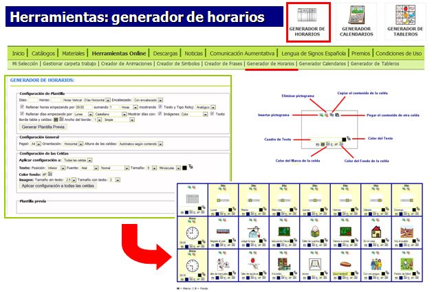
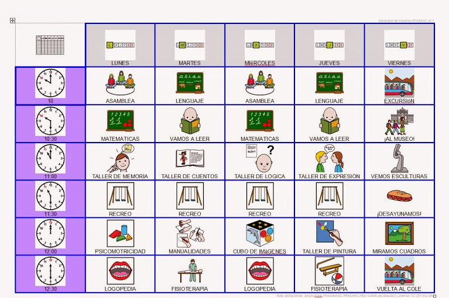

# U3. Generador de Horarios

El generador de horariosfacilita la creación y elaboración de horarios personalizados que ayuden a nuestros alumnos a situarse temporalmente a lo largo de un periodo de tiempo, pudiendo establecer las actividades o rutinas adecuadas para cada momento.

De esta forma, la herramienta ofrece una doble vertiente: la elaboración de horarios y la elaboración de rutinas.

El creador de Horarios al igual que el Creador de Tableros y el de Calendarios exporta el material creador a [formato RTF](http://es.wikipedia.org/wiki/RTF), el cual puede ser abierto y, lo más importante, editado, desde programas como Microsoft Word y Open Officce Writer.

### GENERADOR DE HORARIOS

El generador de horarios permite, una vez configurado el número de días, horas y el intervalo de tiempo entre ambas, generar una plantilla previa (cuadrícula) que podemos rellenar con pictogramas de ARASAAC o con nuestras propias imágenes (previamente subidas a la carpeta de trabajo). Una vez completa la plantilla podemos definir variables relacionadas con el aspecto de las casillas (color de fondo, color de los bordes, tipo de letra, tamaño de los pictogramas, etc.).

4.10 Esquema de funcionamiento del Generador de Horarios

Finalmente, una vez pulsado el botón de generar horario podemos obtener un horario similar al adjuntado a continuación que puede ser impreso o modificado fácilmente desde nuestro editor de texto predeterminado (Microsoft Word u Open Officce Writer).

4.11 Horario ya finalizado e impreso

### GENERADOR DE RUTINAS

Con un sencillo cambio en la configuración de la herramienta (el cambio de las horas de las filas a las columnas) convertimos el generador de horarios en un generador de rutinas.

4.12 Cambio en la configuración de la Herramienta para convertirla en generador de rutinas

Las rutinas son muy importantes, por ejemplo, para niños/as con TEA ya que les permite, no sólo estructurar el tiempo, sino anticipar lo que va a ocurrir a lo largo de un periodo de tiempo (por ejemplo, durante un día en clase) y, por ende, comprender mejor el paso del tiempo.

Una vez establecido el número de pasos de la rutina (horas) generamos la plantilla la cual pasaremos a rellenar con los pictogramas o imágenes que la configuren.

4.13 Plantilla generada por el Generador de Rutinas

Finalmente, una vez pulsado el botón de generar podemos obtener una rutina similar a la adjuntada a continuación que puede ser impresa o modificada fácilmente desde nuestro editor de texto predeterminado (Microsoft Word u Open Officce Writer).

4.14 Rutina ya finalizada e impresa

## Importante

Para aprender el funcionamiento de esta herramienta se puede consultar el manual en:

[http://arasaac.org/zona_descargas/documentacion/manual_generador_horarios_es.pdf](http://arasaac.org/zona_descargas/documentacion/manual_generador_horarios_es.pdf)

