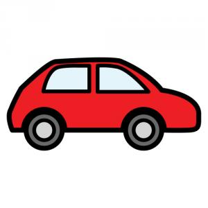
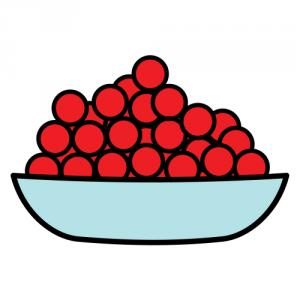
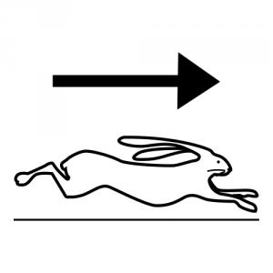
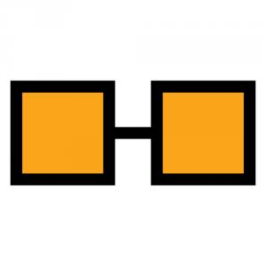
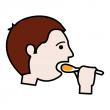
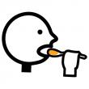

# U4. Los pictogramas como SAAC

Los pictogramas son representaciones gráficas con las que convivimos a diario, casi sin darnos cuenta, en diferentes espacios. Durante varias décadas han demostrado su valía a la hora de presentar una información complementaria al usuario que le ayude a orientarse en el espacio y en el tiempo. Por eso, dentro de los SAAC, uno de los sistemas más utilizados es el de la comunicación mediante&nbsp;**pictogramas.&nbsp;**

Un pictograma es un dibujo que puede representar una realidad concreta (p.e. un objeto, animal, persona, etc.), una realidad abstracta (p.e. un sentimiento), una acción, (p.e. leer), e incluso un elemento gramatical (p.e. adjetivos, conjunciones, artículos, preposiciones, etc.).&nbsp;

El uso de un pictograma para comunicar es para la persona una&nbsp;forma de transformar su realidad en imágenes que representan &ldquo;conceptos&rdquo;, &ldquo;ideas&rdquo;, &ldquo;acciones&rdquo;, &ldquo;elementos que forman parte de su&nbsp;vida cotidiana&rdquo;, y así, a través de esas imágenes, poder expresarse.

Por otro lado, el pictograma refiere a todo el conjunto de personas, objetos o acciones que pudieran representarse con esa imagen (e incluso ideas asociadas). Es decir, al &ldquo;concepto&rdquo;.

<td style="text-align: center;"><pre>Fig. 1.7 Coche****</pre></td>|&nbsp;

|<pre>Fig. 1.8 Zapatos</pre>|&nbsp;

En otras ocasiones, la imagen del pictograma va más allá de cómo ésta aparece, puesto que el &ldquo;concepto&rdquo; o &ldquo;elemento&rdquo; al que se refiere no está directamente representado con el dibujo, sino que es arbitrario y aceptado por convención.

|<pre>Fig. 1.9 Mucho</pre>|&nbsp;

<td style="text-align: center;"><pre>Fig. 1.10 Rápido</pre></td>|&nbsp;

|<pre>Fig. 1.11 Con</pre>|&nbsp;

&nbsp;Además, existen varios tipos de pictogramas:

<td style="text-align: center;" colspan="2">Fig. 1.12 Pictogramas de ARASAAC ([http://arasaac.org](http://arasaac.org))&nbsp;y Sclera ([http://www.sclera.be](http://www.sclera.be))&nbsp;</td>

&nbsp;

(Fuente del texto: [**"Mi comunicador de Pictogramas"**](http://www.ceapat.es/ceapat_01/centro_documental/tecnologiasinformacion/sistemas_comunicacion_aumentativa/IM_055625), Clara Delgado Santos, CEAPAT)

